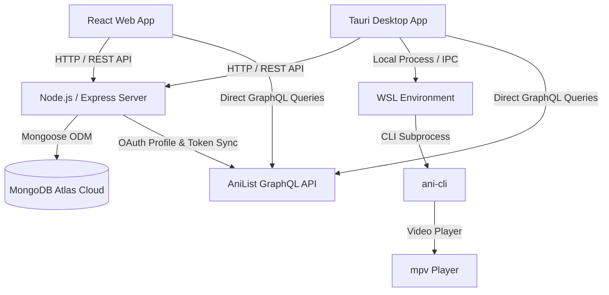

# PAL - Personal Anime Library (v2.0)

[](https://github.com/Prats1729/PALv2)
[](LICENSE)
[](https://react.dev/)
[](https://nodejs.org/)
[](https://www.mongodb.com/)
[](https://tauri.app/)

**PAL (Personal Anime Library)** is a full-stack anime tracking and discovery application built for anime fans. It provides a persistent, cloud-synced watchlist independent of third-party streaming sites, AniList OAuth integration for library import and synchronization, an Animex-inspired mobile-first web interface, and a desktop companion app built with Tauri.

---

## Live Demo

🌐 **Web App:** [Open PAL](https://pal-v2-cyan.vercel.app)

💻 **Desktop App:** [Download for Windows (v2.0.0)](https://github.com/Prats1729/PALv2/releases/latest)


---

## Showcase & Interface

### Desktop Experience

| Section | Preview |
| :--- | :--- |
| **Home Dashboard** |  |
| **Library Management** |  |
| **Anime Details & Episode Tracker** |  |

### Mobile Experience

| Section | Preview |
| :--- | :--- |
| **Mobile Web Experience** |  |

---

## Key Features

### Discovery & Catalog
- **Trending Carousel**: Rotating hero banner displaying currently trending titles with score badges, season tags, and quick-action buttons.
- **Multi-Parameter Filters**: Filter by Genres, Tags, Formats (TV, Movie, OVA, ONA, Special), Seasons, Release Years, and Sort order.
- **URL Search Parameter State**: Catalog filters synchronize with URL query parameters (`useSearchParams`) for shareable links and state persistence on page reloads.
- **Debounced Instant Search**: Floating search input with debounced querying (400ms) and keyboard arrow navigation.

### Library & Cloud Watchlist
- **Persistent MongoDB Storage**: Watchlist records are stored in MongoDB Atlas and associated with user accounts.
- **AniList OAuth & Library Import**: Users can connect their AniList account via OAuth, import their existing library, and synchronize status/progress mutations back to AniList.
- **Watch Status Categories**: Track shows under *Watching*, *Completed*, *On Hold*, *Plan to Watch*, and *Dropped*.
- **Episode Progress Controls**: Manual episode increment/decrement with automatic status updates upon completion.

### Mobile-First Responsive Web Interface
- **Mobile-First Layout**: Full-bleed hero banners, horizontal momentum carousels with card peeking, and 3-column poster browsing grids.
- **Floating Bottom Navigation Bar**: Translucent glass bottom bar (`Home`, `Discover`, `Library`, `Settings`) formatted for mobile viewports.
- **Collapsible Filter Controls**: Mobile drawer for filter options to maintain screen real estate on smaller screens.

### Desktop Companion (Tauri)
- **Desktop Playback Integration**: Integrates with `ani-cli` and `mpv` through Windows Subsystem for Linux (WSL) for local playback.
- **Automated Episode Tracking**: Reads playback progress from an embedded `mpv` Lua script to automatically increment episode counters when ≥70% of an episode is watched.
- **Continue Watching Carousel**: Displays recently watched titles with saved timestamps, episode progress bars, and up-next episode indicators.
- **Custom Themed Setup Installer**: NSIS Windows installer packaged with custom anime ensemble artwork, official PAL logo branding, and automatic desktop shortcuts.

> **Note:** Playback functionality is available only in the desktop version. It requires a local WSL environment with `ani-cli` and `mpv` configured.

### Authentication & Security
- **JWT Session Management**: Token-based authentication with session validation on startup.
- **OAuth Token Encryption**: Connected AniList access tokens are encrypted at rest using AES-256-CBC before database storage.
- **Account Deletion Flow**: Confirmation modal with username verification to delete user accounts and associated watchlist entries.
- **Guest Browsing Mode**: Read-only browsing access for users exploring the catalog without an account.

---

## System Architecture



### Core Technologies

| Layer | Technologies |
| :--- | :--- |
| **Frontend** | React 19, React Router v7, Vite, Vanilla CSS |
| **Backend** | Node.js, Express.js, JWT, bcryptjs, crypto (AES-256-CBC) |
| **Database** | MongoDB Atlas, Mongoose ODM |
| **Desktop Shell** | Tauri v2, Rust, NSIS |
| **External APIs** | AniList GraphQL API |
| **Desktop Playback** | `ani-cli`, `mpv` video player |

---

## Project Structure

```text
PALv2/
├── backend/                  # Express REST API & Database Models
│   ├── middleware/           # JWT authentication middleware
│   ├── routes/               # Auth and Watchlist API routes
│   ├── utils/                # AniList GraphQL importer & AES crypto helpers
│   └── server.js             # Backend server entry point
├── src-tauri/                # Tauri v2 Rust application configuration & IPC handlers
│   ├── icons/                # Multi-resolution application icons (.ico, .icns, .png)
│   ├── nsis/                 # Custom NSIS installer graphics (header & sidebar bitmaps)
│   ├── src/                  # Rust backend logic & command handlers (lib.rs, main.rs)
│   └── tauri.conf.json       # Desktop window, security, and packaging configuration
├── src/                      # Frontend React Application
│   ├── assets/               # SVGs, icons, and branding assets
│   ├── components/
│   │   ├── common/           # Reusable cards, pagination, buttons
│   │   └── layout/           # TopBar, BottomNavBar, modals
│   ├── context/              # AuthContext, WatchlistContext
│   ├── pages/                # Home, Discover, Library, AnimeDetails, Settings, Auth
│   ├── services/             # AniList GraphQL queries & sync mutations
│   ├── styles/               # Component stylesheets
│   ├── App.jsx               # Router configuration & providers
│   ├── App.css               # Design tokens, themes, mobile media queries
│   └── main.jsx              # React DOM entry point
├── package.json              # Workspace dependencies & build scripts
└── README.md                 # Project documentation
```

---

## Getting Started

### Prerequisites

- **Node.js**: v18.0.0 or higher
- **MongoDB**: MongoDB Atlas cluster or local instance
- **Rust & Cargo** *(Optional, for building the desktop app)*: [Install Rust](https://www.rust-lang.org/tools/install)
- **WSL & ani-cli** *(Optional, for desktop playback)*: [ani-cli](https://github.com/pystardust/ani-cli)

---

### Installation & Local Setup

1. **Clone the repository:**
   ```bash
   git clone https://github.com/Prats1729/PALv2.git
   cd PALv2
   ```

2. **Configure Environment Variables:**

   Create `.env` in the project root:
   ```env
   VITE_API_URL=http://localhost:5000
   VITE_ANILIST_CLIENT_ID=your_anilist_client_id
   ```

   Create `backend/.env`:
   ```env
   PORT=5000
   MONGODB_URI=your_mongodb_connection_uri
   JWT_SECRET=your_jwt_secret_key
   ENCRYPTION_KEY=your_64_character_hex_aes_encryption_key
   ```

3. **Install dependencies:**
   ```bash
   npm install
   cd backend && npm install && cd ..
   ```

4. **Start Development Servers:**

   *Terminal 1 (Backend API):*
   ```bash
   cd backend
   node server.js
   ```

   *Terminal 2 (Frontend Web):*
   ```bash
   npm run dev
   ```

   *Terminal 3 (Tauri Desktop App - Optional):*
   ```bash
   npx tauri dev
   ```

5. **Build for Production:**

   *Web Client:*
   ```bash
   npm run build
   ```

   *Desktop App & Windows Setup Installer:*
   ```bash
   npx tauri build
   ```
   The generated `.exe` installer will be located in `src-tauri/target/release/bundle/nsis/`.

---

## License

This project is licensed under the MIT License. See the [LICENSE](LICENSE) file for details.

---

## Acknowledgements

- [AniList API](https://anilist.gitbook.io/anilist-apiv2-docs) for providing anime metadata and GraphQL endpoints.
- [ani-cli](https://github.com/pystardust/ani-cli) for CLI video playback tooling.
- [Tauri](https://tauri.app) for the lightweight desktop application runtime.
