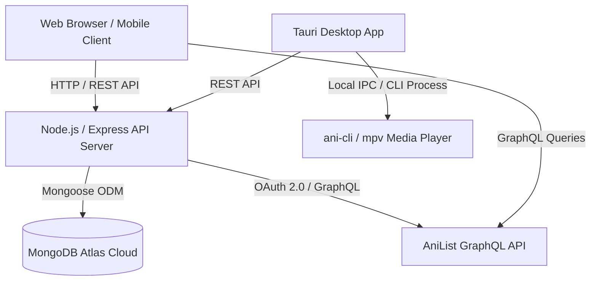

# PAL - Personal Anime Library (v2.0)

[](https://github.com/Prats1729/PALv2)
[](LICENSE)
[](https://react.dev/)
[](https://nodejs.org/)
[](https://www.mongodb.com/)
[](https://tauri.app/)

**PAL (Personal Anime Library)** is a modern, full-stack anime tracking and discovery application designed for anime enthusiasts. It provides a persistent, cloud-synced watchlist independent of external piracy platforms, paired with AniList OAuth synchronization, an Animex-inspired mobile-first web interface, and a native desktop companion powered by Tauri.

---

## Showcase & Interface

### Desktop Experience

| Section | Preview |
| :--- | :--- |
| **Home Dashboard** |  |
| **Library Management** |  |
| **Anime Details & Episode Tracker** |  |

### Mobile Experience

| Section | Preview |
| :--- | :--- |
| **Mobile Web Experience** |  |

---

## Key Features

### 🎬 Discovery & Catalog
- **Cinematic Hero Spotlight**: Auto-rotating hero slider showcasing current trending titles with metadata badges, status tags, and instant actions.
- **Deep Filter System**: Multi-parameter search across Genres, Tags, Formats (TV, Movie, OVA, ONA, Special), Seasons, Release Years, and Sorting algorithms.
- **URL Parameter State Sync**: URL search parameters (`useSearchParams`) maintain exact catalog filter state for easy link sharing and refreshing.
- **Debounced Instant Search**: Floating search palette featuring real-time autocomplete results and keyboard navigation.

### 📚 Personal Library & Cloud Watchlist
- **Persistent Cloud Watchlist**: MongoDB Atlas storage linked to individual user accounts, replacing browser-only storage.
- **AniList Two-Way Synchronization**: Secure OAuth 2.0 integration allowing one-click import and synchronized progress tracking across both PAL and AniList.
- **Watch Status Tracking**: Segment titles by *Watching*, *Completed*, *On Hold*, *Plan to Watch*, and *Dropped*.
- **Progress Tracking**: Granular episode counters with auto-completion triggers.

### 📱 Mobile-First Responsive Web App
- **Animex-Inspired Mobile UI**: Full-bleed hero banners, horizontal momentum touch carousels with card peeking, and compact 3-column poster browsing grids.
- **Floating Glass Bottom Navigation**: Translucent pill navigation bar (`Home`, `Discover`, `Library`, `Settings`) with iOS/Android safe-area inset support.
- **Collapsible Mobile Filters**: Drawer filter accordion on catalog pages to keep cards front-and-center on smaller viewports.

### 🖥️ Native Desktop Companion (Tauri)
- **Zero-Ad Native Streaming**: Direct integration with `ani-cli` and `mpv` player via Windows Subsystem for Linux (WSL).
- **Automated Progress Sync**: Real-time process monitoring that detects watched episodes in `mpv` and automatically increments cloud watchlist progress.
- **Continue Watching Hub**: Dedicated resume hub displaying recent timestamps, progress percentages, and up-next episode indicators.

### 🔒 Authentication & Security
- **JWT Session Management**: Encrypted token-based authentication with automatic session validation on application startup.
- **Two-Level Account Lifecycle**: Account deletion safety modal with typed username confirmation and cascading data cleanup.
- **Encrypted Token Vault**: AES encryption for connected third-party OAuth access tokens.
- **Guest Exploration Mode**: Instant read-only browsing access for prospective users without immediate registration.

---

## Architecture & Tech Stack



### Core Technologies

| Layer | Technologies |
| :--- | :--- |
| **Frontend** | React 19, React Router v7, Vite, Vanilla CSS Design System |
| **Backend** | Node.js, Express.js, JWT, bcryptjs, crypto (AES) |
| **Database** | MongoDB Atlas, Mongoose ODM |
| **Desktop Shell** | Tauri v2, Rust |
| **External APIs** | AniList GraphQL API |
| **Player Pipeline** | `ani-cli`, `mpv` video player |

---

## Project Structure

```text
PALv2/
├── backend/                  # Express REST API & Database Models
│   ├── config/               # Database connection configuration
│   ├── middleware/           # JWT authentication middleware
│   ├── models/               # Mongoose schemas (User, Watchlist)
│   ├── routes/               # API endpoints (Auth, Watchlist)
│   ├── utils/                # AniList GraphQL importer & crypto helpers
│   └── server.js             # Backend server entry point
├── src-tauri/                # Tauri v2 Rust desktop application configuration
├── src/                      # Frontend Single Page Application (React)
│   ├── assets/               # SVGs, icons, and branding assets
│   ├── components/
│   │   ├── common/           # Reusable cards, pagination, buttons
│   │   └── layout/           # TopBar, BottomNavBar, companion modals
│   ├── context/              # AuthContext, WatchlistContext
│   ├── pages/                # Home, Discover, Library, AnimeDetails, Settings, Auth
│   ├── services/             # AniList GraphQL service integration
│   ├── styles/               # Component-level stylesheets
│   ├── App.jsx               # Route coordinator and global providers
│   ├── App.css               # Design tokens, theme variables, mobile media queries
│   └── main.jsx              # React DOM mounting entry point
├── package.json              # Workspace manifest & scripts
└── README.md                 # Project documentation
```

---

## Getting Started

### Prerequisites

- **Node.js**: v18.0.0 or higher
- **MongoDB**: MongoDB Atlas connection URI or local instance
- **Rust & Cargo** *(Optional, for building desktop app)*: [Install Rust](https://www.rust-lang.org/tools/install)
- **WSL & ani-cli** *(Optional, for desktop playback)*: [ani-cli](https://github.com/pystardust/ani-cli)

---

### Installation & Local Setup

1. **Clone the repository:**
   ```bash
   git clone https://github.com/Prats1729/PALv2.git
   cd PALv2
   ```

2. **Configure Environment Variables:**

   Create `.env` in the root directory:
   ```env
   VITE_API_URL=http://localhost:5000
   VITE_ANILIST_CLIENT_ID=your_anilist_oauth_client_id
   ```

   Create `backend/.env`:
   ```env
   PORT=5000
   MONGO_URI=your_mongodb_connection_string
   JWT_SECRET=your_jwt_secret_key
   ENCRYPTION_KEY=your_32_character_aes_encryption_key
   ANILIST_CLIENT_ID=your_anilist_client_id
   ANILIST_CLIENT_SECRET=your_anilist_client_secret
   ```

3. **Install dependencies:**
   ```bash
   npm install
   cd backend && npm install && cd ..
   ```

4. **Start the Development Servers:**

   *Terminal 1 (Backend API):*
   ```bash
   cd backend
   node server.js
   ```

   *Terminal 2 (Frontend Web):*
   ```bash
   npm run dev
   ```

   *Terminal 3 (Tauri Desktop App - Optional):*
   ```bash
   npx tauri dev
   ```

5. **Build for Production:**
   ```bash
   npm run build
   ```

---

## License

This project is licensed under the MIT License. See the [LICENSE](LICENSE) file for details.

---

## Acknowledgements

- [AniList API](https://anilist.gitbook.io/anilist-apiv2-docs) for providing anime metadata and GraphQL endpoints.
- [ani-cli](https://github.com/pystardust/ani-cli) for CLI video streaming capabilities.
- [Tauri](https://tauri.app) for the lightweight desktop application runtime.
